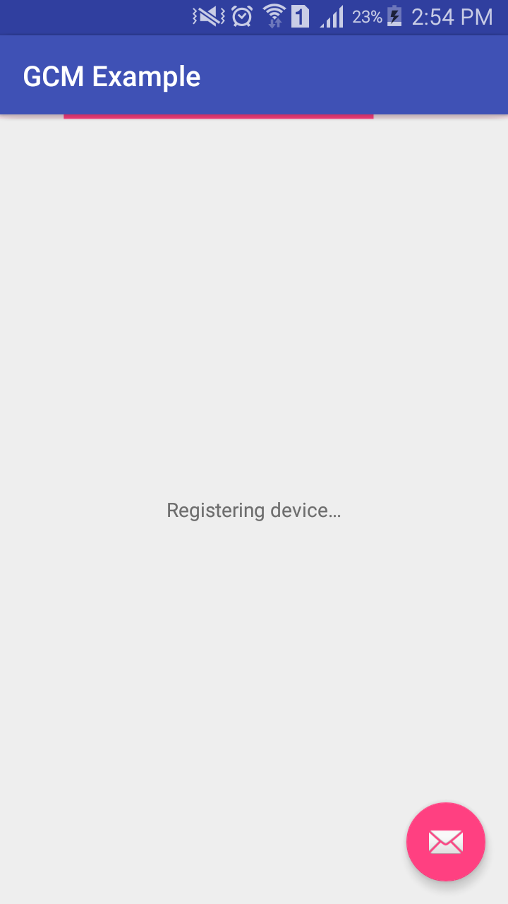
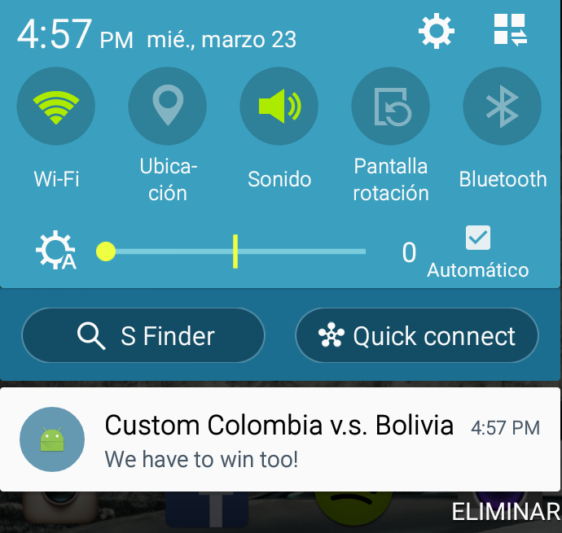
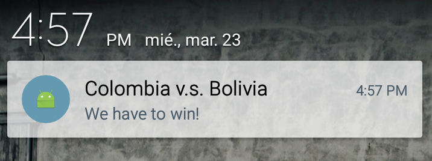
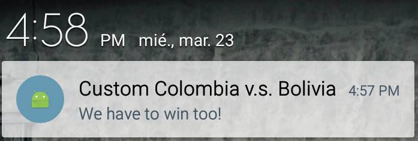

# GCM Android Showcase

## Prelude
Here you will find a simple project that implements an Android-based client application for Google Cloud Messaging service. 

## Screenshots

 

## Try it yourself
You should follow instructions given in the official reference to setup your Google application with GCM and use your own
configuration in this app (`google-service.json`)

Cloud Messaging, Google’s Developer Console. https://developers.google.com/cloud-messaging/
